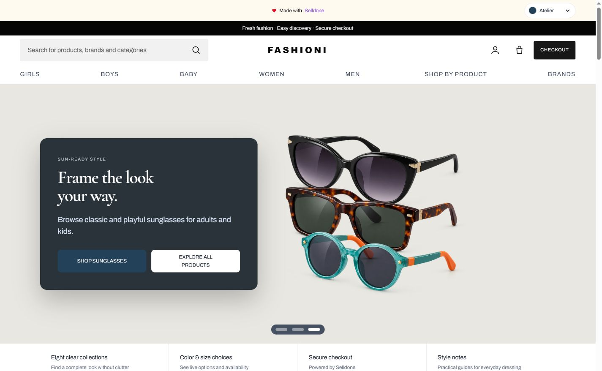
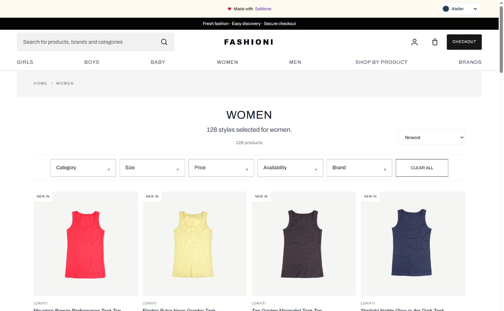
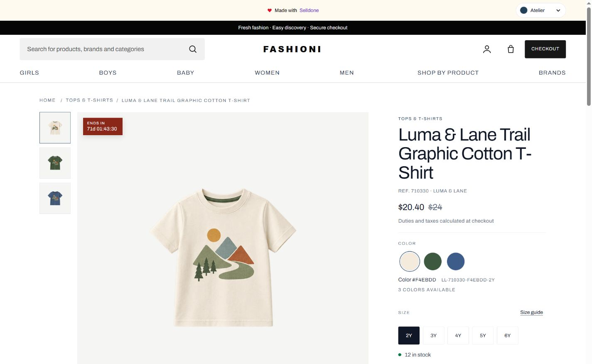
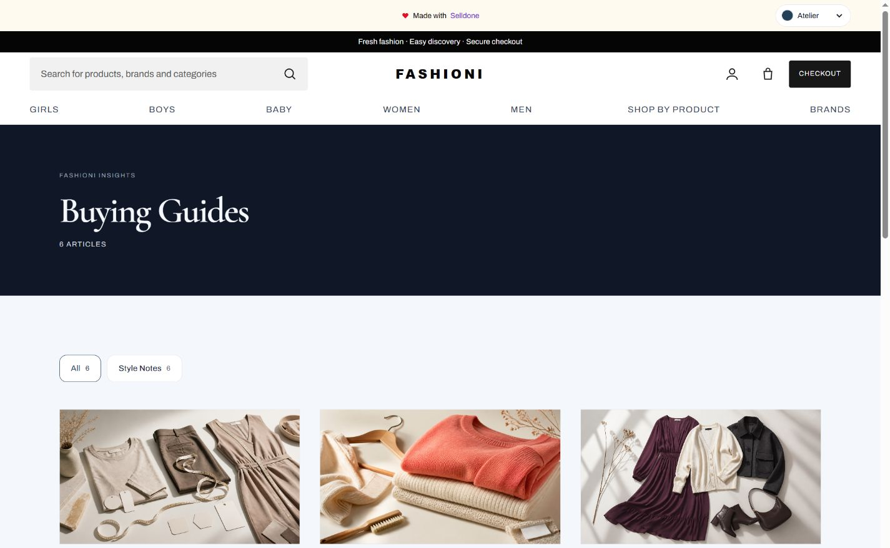
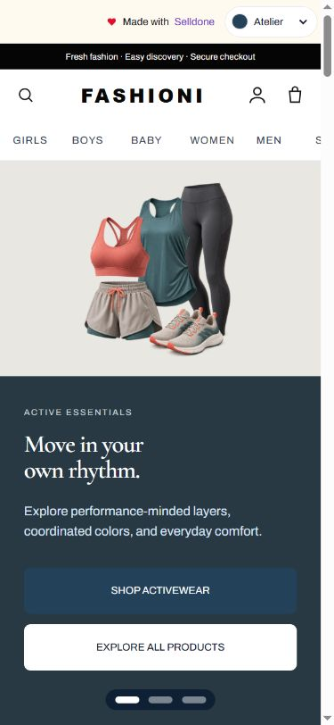
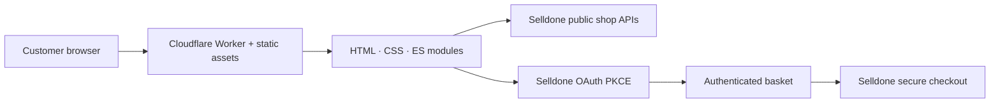

# Fashioni

<p align="center">
  <strong>A production-ready fashion storefront powered by Selldone and Cloudflare Workers.</strong><br>
  Responsive editorial design, real catalogue data, color and size variants, timed offers, secure checkout, and a reusable Fashioni v2 starter.
</p>

<p align="center">
  <a href="https://fashioni.selldone.shop/"></a>
  <a href="https://selldone.com/"></a>
  <a href="https://workers.cloudflare.com/"></a>
  
  
</p>

<p align="center">
  <a href="https://fashioni.selldone.shop/">Live store</a> ·
  <a href="https://selldone-fashioni.ee-shirdel.workers.dev/">Workers preview</a> ·
  <a href="#quick-start">Run locally</a> ·
  <a href="#reuse-fashioni-v2-for-another-store">Reuse the starter</a>
</p>



## Overview

Fashioni is a static-first, API-backed storefront for physical fashion products. The visual system combines clear department navigation, generous editorial spacing, campaign-scale imagery, and dense but usable product discovery. Selldone remains the source of truth for catalogue, inventory, variants, basket, authentication, and checkout; Cloudflare serves the storefront at the edge.

| Store capability | Current implementation |
| --- | --- |
| Catalogue | 195 physical products loaded from Selldone |
| Navigation | Centered All Products, Girls, Boys, Baby, Women, Men, and Brands links |
| Taxonomy | 8 real product-type roots plus audience shortcuts; no navigation-label wrappers |
| Product options | Color-linked gallery images, sizes, SKUs, price, and live stock |
| Merchandising | Trending, Best Sellers, New In, timed-sale badges, and countdowns |
| Discovery | Search, A–Z brand directory, brand/category/size/price/availability filters, and sorting |
| Editorial | 6 original Style Notes sourced from the connected shop |
| Checkout | OAuth Authorization Code with PKCE and Selldone secure checkout |
| Responsive layout | Desktop, tablet, and mobile storefronts without horizontal overflow |
| Themes | Atelier, Plum, Forest, Sand, and Rose |

## Storefront tour

### Product discovery

Filters remain above the grid, product cards show real pricing and availability, and category pages keep the shopping context visible.



### Product detail and commerce

Product pages connect every available color to the correct image, keep multiple sizes available per color where inventory permits, expose a responsive size guide, and distinguish **Add to bag** from **Buy now**. Timed offers show both prices and a live countdown.



### Editorial and mobile

<table>
  <tr>
    <td width="72%"></td>
    <td width="28%"></td>
  </tr>
  <tr>
    <td align="center"><strong>Style Notes</strong> — illustrated buying guides from Selldone</td>
    <td align="center"><strong>Mobile</strong> — compact navigation and stacked campaigns</td>
  </tr>
</table>

## Architecture



- **Frontend:** semantic HTML, modern CSS, and native ES modules; no client framework required.
- **Commerce:** Selldone shop APIs and OAuth PKCE. No OAuth client secret is shipped to the browser.
- **Hosting:** Cloudflare Workers static assets with a custom production hostname.
- **Validation:** Playwright-backed responsive, route, image, control, hero, and portability checks.

## Quick start

Requirements: Node.js 20+ and npm.

```bash
git clone https://github.com/alireza-selldone/selldone-fashioni.git
cd selldone-fashioni
npm ci
npm run dev
```

Open the local URL printed by the development server. Public, non-secret shop configuration lives in [`shop.config.json`](shop.config.json).

## Useful commands

| Command | Purpose |
| --- | --- |
| `npm run dev` | Serve the source storefront locally |
| `npm run build:pages` | Regenerate informational and editorial pages |
| `npm run build` | Build the deployable static storefront |
| `npm run preview` | Build and preview the generated output |
| `npm run check` | Run the complete quality gate |
| `npm run setup -- ...` | Repoint the starter to another Selldone shop |
| `npm run deploy` | Deploy with Wrangler |

## Reuse Fashioni v2 for another store

The reusable Codex skill is tracked in [`skills/setup-selldone-fashion-store`](skills/setup-selldone-fashion-store). Its bootstrap helper clones the latest tracked `main`, validates [`starter.manifest.json`](starter.manifest.json), exports Git-tracked files only, and writes `.starter-provenance.json` with the exact source commit.

From an installed or downloaded copy of the skill:

```bash
python scripts/bootstrap_fashioni_starter.py <empty-project-directory>
```

Configure the new project:

```bash
npm ci
npm run setup -- \
  --shop-id <selldone-shop-id> \
  --handle <shop-handle> \
  --name "<Visible Store Name>" \
  --domain "<store-domain>"
npm run build:pages
npm run build
```

Setup rewrites the visible brand identity and clears the source store's domain, OAuth client, and audience mappings before the new storefront is built. The v2 contract requires the Best Seller section, timed-sale countdowns, size-guide sheet, color-aware cards, and the current layout; obsolete ruler/rail components are explicitly rejected.

See the complete workflow and acceptance criteria:

- [`SKILL.md`](skills/setup-selldone-fashion-store/SKILL.md)
- [`starter contract`](skills/setup-selldone-fashion-store/references/starter-contract.md)
- [`acceptance checklist`](skills/setup-selldone-fashion-store/references/acceptance-checklist.md)

## Quality gate

Start the development server, then run:

```bash
npm run check
```

The current Fashioni v2 release passed:

- 44 responsive assertions across desktop, tablet, and mobile widths
- 195 product pages and 3,595 rendered images
- image containment and broken-aspect negative controls
- route uniqueness, footer links, and policy anchors
- static-header consistency before JavaScript hydration
- dead-control detection with zero dead controls
- campaign hero containment and high-resolution artwork checks
- starter portability across different category counts and slugs
- configuration and secret-leak checks

## Configuration

[`shop.config.json`](shop.config.json) contains public storefront configuration only:

- shop ID, handle, display name, and public domain
- public OAuth client ID and application name
- brand copy and announcement text
- category and audience mappings
- campaign slides and category hero products
- optional merchant contact fields

Never place a client secret, API token, private key, or privileged Selldone credential in this file or in browser code.

## Deployment

```bash
npm run build
npm run deploy
```

The default Worker is `selldone-fashioni`, with production hosted at [fashioni.selldone.shop](https://fashioni.selldone.shop/). [`wrangler.toml`](wrangler.toml) defines the normal static-assets deployment. [`wrangler.proxy.toml`](wrangler.proxy.toml) and [`worker-proxy.mjs`](worker-proxy.mjs) support the commit-pinned, Cloudflare-cached proxy workflow used when a local Wrangler OAuth session is unavailable.

## Repository layout

```text
.
├── storefront/                 # Source HTML, CSS, JavaScript, and visual assets
├── store-pages/                # Generated-page source content
├── scripts/                    # Build, setup, audit, and validation tools
├── skills/                     # Reusable Fashioni v2 Codex skill
├── docs/screenshots/           # Current README screenshots
├── shop.config.json            # Public shop-specific configuration
├── starter.manifest.json       # Versioned starter contract and design markers
├── wrangler.toml               # Cloudflare Workers deployment
└── package.json                # Development, build, check, and deploy commands
```

## Data integrity

Prices, stock, variants, categories, product imagery, and articles are loaded from the connected Selldone shop. Material, fit, care, delivery, return, and merchant-contact information is shown only when supplied by the product or merchant. Sample reviews are clearly labelled and never included in the real product rating.

---

Built as a reusable Selldone fashion commerce reference: **Style for every move.**
