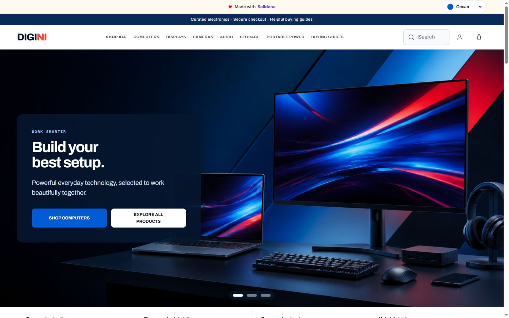
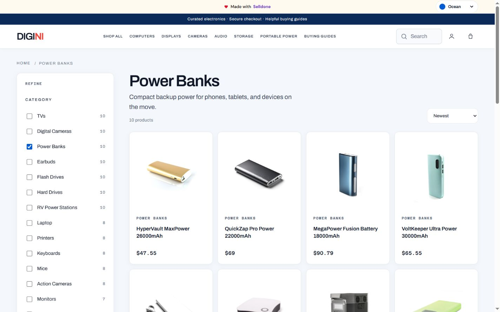
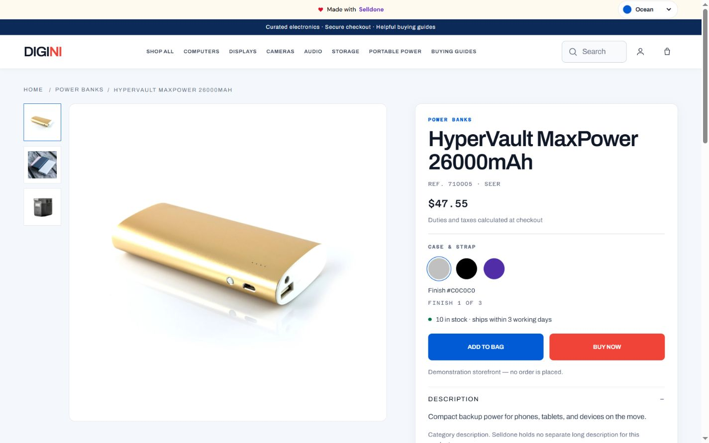
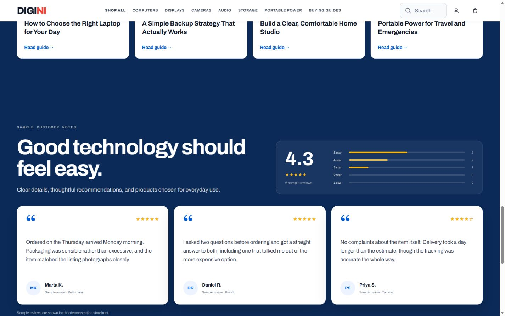
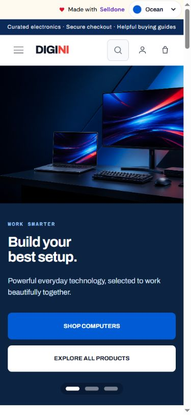

<div align="center">

# Digini

**Technology for every day.**

A responsive electronics storefront powered by Selldone and deployed on Cloudflare Workers.

[**View the live store →**](https://digini.selldone.shop/)

</div>



## Visual tour

### Product discovery

The shop combines four-column desktop browsing, category filters, a dual-handle price range, manual price inputs, sorting, search, and a compact two-column mobile layout.



### Product details

Each product page includes a responsive gallery, image-linked color variants, stock and pricing details, paired purchase actions, related products, and customer reviews.



### Customer reviews

The home page includes a dedicated review experience with a rating summary, distribution chart, and clearly labeled sample testimonials.



### Mobile experience

Navigation, hero content, product grids, filters, typography, and spacing are optimized for smaller screens.

<div align="center">
  
</div>

## Highlights

- Live catalog data from the Selldone XAPI
- Responsive four-column desktop and two-column mobile product grids
- Category, availability, brand, and price filtering
- Skeleton loading states that preserve page layout
- Product galleries with image-linked color selections
- Related-product carousels with arrow navigation
- Five selectable color themes stored across visits
- Four editorial buying guides with original artwork
- Shared header and footer across the storefront
- Public OAuth Authorization Code flow with PKCE
- Static delivery through Cloudflare Workers Assets

## Stack

- Semantic HTML, modern CSS, and native JavaScript modules
- Selldone XAPI for products, categories, and customer flows
- Cloudflare Workers Static Assets for production hosting
- Playwright-based visual and interaction checks
- Wrangler for preview and deployment

## Project structure

```text
storefront/     Storefront source, styles, and browser modules
store-pages/    Generated shop, product, and editorial pages
shared/         Shared runtime utilities and configuration
scripts/        Build, development, and verification tooling
docs/           Technical notes and production screenshots
dist/           Generated deployable site
```

## Local development

Requirements: Node.js 20 or newer.

```bash
npm install
npm run dev
```

The development server opens at `http://localhost:8788/` by default. Public shop identity and catalog settings live in [`shop.config.json`](shop.config.json).

## Build and verify

```bash
npm run build
npm run check
```

For focused checks, the project also provides `check:leak`, `check:images`, `check:pages`, `check:controls`, `check:hero`, and `check:port` scripts.

## Deploy

```bash
npm run deploy
```

Wrangler publishes the generated `dist/` directory to the `digini` Worker. The production custom domain is [digini.selldone.shop](https://digini.selldone.shop/).

## Configuration and documentation

- [`SETUP.md`](SETUP.md) explains how to connect the storefront to another Selldone shop.
- [`docs/technical-reference.md`](docs/technical-reference.md) documents architecture, API boundaries, OAuth, and build behavior.
- [`DECISIONS.md`](DECISIONS.md) records the design and implementation decisions behind the storefront.

## Demo notice

Digini is a demonstration storefront. No real order is placed, and sample customer reviews are visibly labeled as demonstration content.

<sub>Production screenshots captured from the live storefront on 18 August 2026.</sub>
